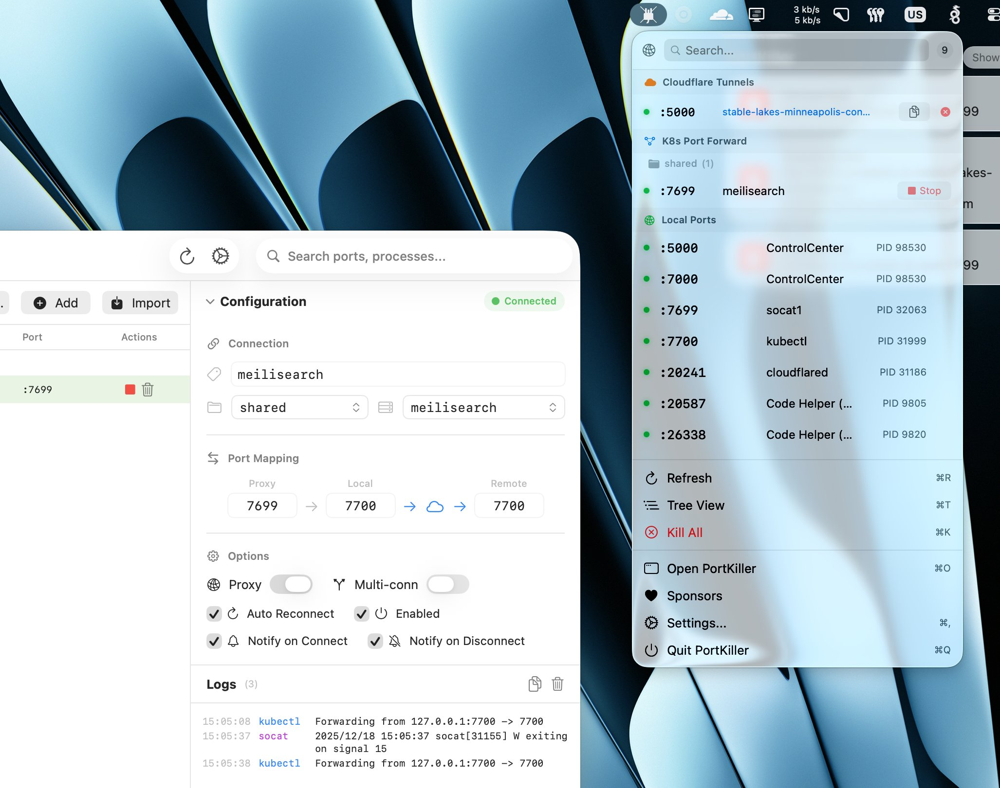
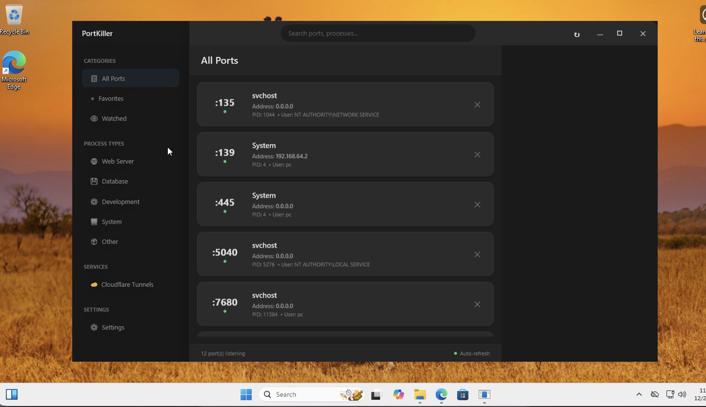

# PortKiller

<p align="center">
  
</p>

<p align="center">
  <a href="LICENSE"></a>
  <a href="https://www.apple.com/macos/"></a>
  <a href="https://www.microsoft.com/windows"></a>
  <a href="https://github.com/productdevbook/port-killer/releases"></a>
</p>

<p align="center">
A native app for finding and killing processes on open ports.<br>
Perfect for developers who need to quickly free up ports like 3000, 8080, 5173, etc.
</p>

### macOS

<p align="center">
  
</p>

### Windows

<p align="center">
  
</p>

## Installation

### macOS

**Homebrew:**
```bash
brew install --cask productdevbook/tap/portkiller
```

**Manual:** Download `.dmg` from [GitHub Releases](https://github.com/productdevbook/port-killer/releases).

### Windows

Download `.zip` from [GitHub Releases](https://github.com/productdevbook/port-killer/releases) and extract.

## Features

- 📍 Menu bar integration (macOS) / System tray (Windows)
- 🔍 Auto-discovers listening TCP ports
- ⚡ One-click process termination
- 🔄 Auto-refresh
- 🔎 Search by port or process name
- ⭐ Favorites and watched ports
- 📂 Process type categorization (Web Server, Database, Development, System)
- 🔗 Port forwarding management (Kubernetes kubectl)
- ☁️ Cloudflare Tunnels integration

## Contributing

See [CONTRIBUTING.md](CONTRIBUTING.md) for development setup.

## Sponsors

<p align="center">
  <a href="https://cdn.jsdelivr.net/gh/productdevbook/static/sponsors.svg">
    
  </a>
</p>

## License

MIT License - see [LICENSE](LICENSE).
